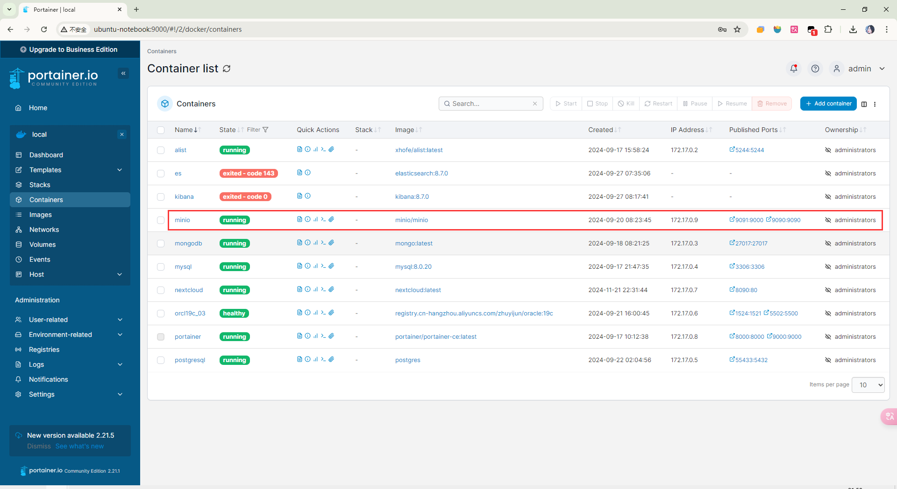
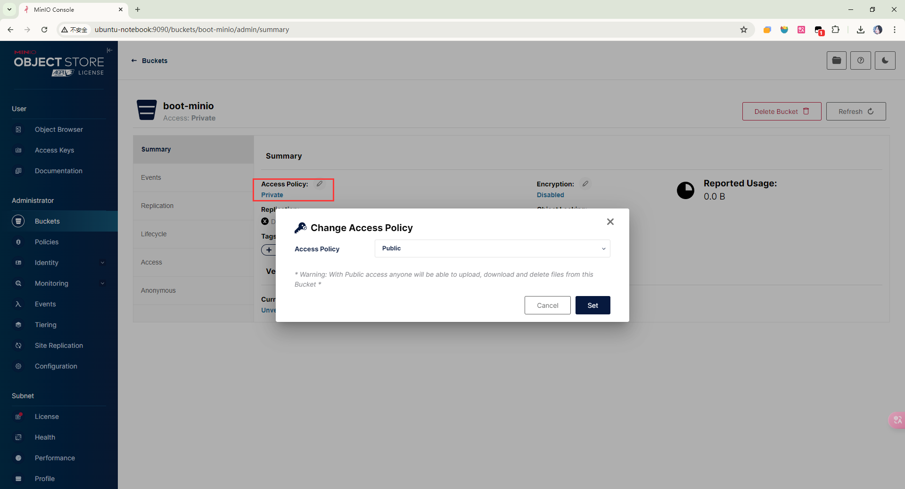
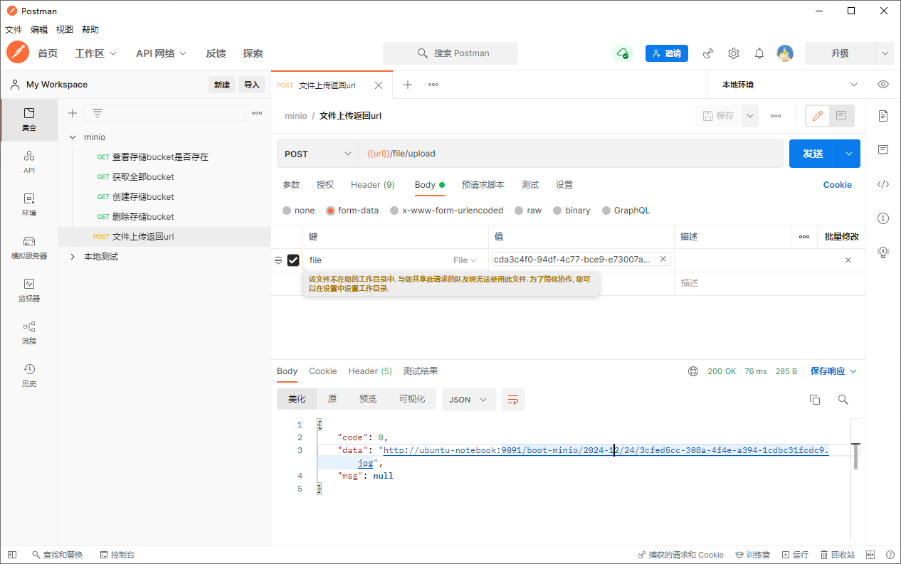

# Springboot整合Minio

> 我这里已经使用Docker配置了一个Minio容器
>
> 参考[博客](https://blog.csdn.net/Darling_qi/article/details/124743303)



> 创建桶


> 点进去之后，设置为`public`



> 以下是SpringBoot代码
>
> `pom.xml`

```xml
<dependencies>
    <dependency>
        <groupId>org.springframework.boot</groupId>
        <artifactId>spring-boot-starter-web</artifactId>
    </dependency>
    <!-- https://mvnrepository.com/artifact/io.minio/minio -->
    <dependency>
        <groupId>io.minio</groupId>
        <artifactId>minio</artifactId>
        <version>8.2.2</version>
    </dependency>
    <dependency>
        <groupId>cn.hutool</groupId>
        <artifactId>hutool-all</artifactId>
        <version>5.8.16</version>
    </dependency>
    <dependency>
        <groupId>org.projectlombok</groupId>
        <artifactId>lombok</artifactId>
        <optional>true</optional>
    </dependency>
    <dependency>
        <groupId>org.springframework.boot</groupId>
        <artifactId>spring-boot-starter-test</artifactId>
        <scope>test</scope>
    </dependency>
</dependencies>
```

> `application.yml`

```yaml
# 应用服务 WEB 访问端口
server:
  port: 8080

minio:
  endpoint: http://ubuntu-notebook:9091 # Minio服务所在地址,如192.168.42.128:9091
  bucketName: boot-minio # 存储桶名称
  accessKey: minioadmin # 访问的key
  secretKey: minioadmin # 访问的秘钥
```

> 配置类

```java
@Data
@Configuration
@ConfigurationProperties(prefix = "minio")
public class MinioConfig {

    private String endpoint;
    private String accessKey;
    private String secretKey;
    private String bucketName;

    @Bean
    public MinioClient minioClient() {
        return MinioClient.builder()
                .endpoint(endpoint)
                .credentials(accessKey, secretKey)
                .build();
    }
}
```

> 以下是两个工具类

```java
@Data
@AllArgsConstructor
@NoArgsConstructor
public class JsonData {
    /**
     * 状态码 0 表示成功，1表示处理中，-1表示失败
     */
    private Integer code;
    /**
     * 数据
     */
    private Object data;
    /**
     * 描述
     */
    private String msg;

    /**
     * 成功，传入数据
     *
     * @return
     */
    public static JsonData buildSuccess() {
        return new JsonData(0, null, null);
    }

    /**
     * 成功，传入数据
     *
     * @param data
     * @return
     */
    public static JsonData buildSuccess(Object data) {
        return new JsonData(0, data, null);
    }

    /**
     * 失败，传入描述信息
     *
     * @param msg
     * @return
     */
    public static JsonData buildError(String msg) {
        return new JsonData(-1, null, msg);
    }

    /**
     * 失败，传入描述信息,状态码
     *
     * @param msg
     * @param code
     * @return
     */
    public static JsonData buildError(String msg, Integer code) {
        return new JsonData(code, null, msg);
    }
}
```

```java
@Component
@Slf4j
public class MinioUtil {
    @Autowired
    private MinioConfig prop;

    @Resource
    private MinioClient minioClient;

    /**
     * 查看存储bucket是否存在
     *
     * @return boolean
     */
    @SneakyThrows
    public Boolean bucketExists(String bucketName) {
        return minioClient.bucketExists(BucketExistsArgs.builder().bucket(bucketName).build());
    }

    /**
     * 创建存储bucket
     *
     * @return Boolean
     */
    @SneakyThrows
    public Boolean makeBucket(String bucketName) {
        minioClient.makeBucket(MakeBucketArgs.builder()
                .bucket(bucketName)
                .build());
        return true;
    }

    /**
     * 删除存储bucket
     *
     * @return Boolean
     */
    @SneakyThrows
    public Boolean removeBucket(String bucketName) {
        minioClient.removeBucket(RemoveBucketArgs.builder()
                .bucket(bucketName)
                .build());
        return true;
    }

    /**
     * 获取全部bucket
     */
    @SneakyThrows
    public List<Bucket> getAllBuckets() {
        return minioClient.listBuckets();
    }


    /**
     * 文件上传
     *
     * @param file 文件
     * @return Boolean
     */
    @SneakyThrows
    public String upload(MultipartFile file) {
        String originalFilename = file.getOriginalFilename();
        if (StrUtil.isBlank(originalFilename)) {
            throw new RuntimeException();
        }
        String fileName = IdUtil.randomUUID() + originalFilename.substring(originalFilename.lastIndexOf("."));
        //String objectName = CommUtils.getNowDateLongStr("yyyy-MM/dd") + "/" + fileName;
        String objectName = DateUtil.format(DateUtil.date(), "yyyy-MM/dd") + "/" + fileName;
        PutObjectArgs objectArgs = PutObjectArgs.builder().bucket(prop.getBucketName()).object(objectName)
                .stream(file.getInputStream(), file.getSize(), -1).contentType(file.getContentType()).build();
        //文件名称相同会覆盖
        minioClient.putObject(objectArgs);
        return objectName;
    }

    /**
     * 预览图片
     *
     * @param fileName
     * @return
     */
    @SneakyThrows
    public String preview(String fileName) {
        // 查看文件地址
        GetPresignedObjectUrlArgs build = GetPresignedObjectUrlArgs.builder().bucket(prop.getBucketName()).object(fileName).method(Method.GET).build();
        return minioClient.getPresignedObjectUrl(build);
    }

    /**
     * 文件下载
     *
     * @param fileName 文件名称
     * @param res      response
     * @return Boolean
     */
    @SneakyThrows
    public void download(String fileName, HttpServletResponse res) {
        GetObjectArgs objectArgs = GetObjectArgs.builder().bucket(prop.getBucketName())
                .object(fileName).build();
        GetObjectResponse response = minioClient.getObject(objectArgs);
        byte[] buf = new byte[1024];
        int len;
        try (FastByteArrayOutputStream os = new FastByteArrayOutputStream()) {
            while ((len = response.read(buf)) != -1) {
                os.write(buf, 0, len);
            }
            os.flush();
            byte[] bytes = os.toByteArray();
            res.setCharacterEncoding("utf-8");
            // 设置强制下载不打开
            // res.setContentType("application/force-download");
            res.addHeader("Content-Disposition", "attachment;fileName=" + fileName);
            try (ServletOutputStream stream = res.getOutputStream()) {
                stream.write(bytes);
                stream.flush();
            }
        }
    }

    /**
     * 查看文件对象
     *
     * @return 存储bucket内文件对象信息
     */
    @SneakyThrows
    public List<Item> listObjects() {
        Iterable<Result<Item>> results = minioClient.listObjects(
                ListObjectsArgs.builder().bucket(prop.getBucketName()).build());
        List<Item> items = new ArrayList<>();
        for (Result<Item> result : results) {
            items.add(result.get());
        }
        return items;
    }

    /**
     * 删除
     *
     * @param fileName
     * @return
     * @throws Exception
     */
    @SneakyThrows
    public boolean remove(String fileName) {
        minioClient.removeObject(RemoveObjectArgs.builder().bucket(prop.getBucketName()).object(fileName).build());
        return true;
    }

}
```

>以下是待测试的接口

```java
@RestController
@RequestMapping("/file")
public class FileController {
    @Autowired
    private MinioUtil minioUtil;
    @Autowired
    private MinioConfig prop;

    /**
     * 查看存储bucket是否存在
     *
     * @param bucketName
     * @return
     */
    @GetMapping("/bucketExists")
    public JsonData bucketExists(@RequestParam("bucketName") String bucketName) {
        return JsonData.buildSuccess(minioUtil.bucketExists(bucketName));
    }

    /**
     * 创建存储bucket
     *
     * @param bucketName
     * @return
     */
    @GetMapping("/makeBucket")
    public JsonData makeBucket(String bucketName) {
        return JsonData.buildSuccess(minioUtil.makeBucket(bucketName));
    }

    /**
     * 删除存储bucket
     *
     * @param bucketName
     * @return
     */
    @GetMapping("/removeBucket")
    public JsonData removeBucket(String bucketName) {
        return JsonData.buildSuccess(minioUtil.removeBucket(bucketName));
    }

    /**
     * 获取全部bucket
     *
     * @return
     */
    @GetMapping("/getAllBuckets")
    public JsonData getAllBuckets() {
        Set<String> collect = minioUtil.getAllBuckets().stream().map(Bucket::name).collect(Collectors.toSet());
        return JsonData.buildSuccess(collect);
    }

    /**
     * 文件上传返回url
     *
     * @param file
     * @return
     */
    @PostMapping("/upload")
    public JsonData upload(@RequestParam("file") MultipartFile file) {
        String objectName = minioUtil.upload(file);
        if (null != objectName) {
            return JsonData.buildSuccess((prop.getEndpoint() + "/" + prop.getBucketName() + "/" + objectName));
        }
        return JsonData.buildError("上传失败");
    }

    /**
     * 图片/视频预览
     *
     * @param fileName
     * @return
     */
    @GetMapping("/preview")
    public JsonData preview(@RequestParam("fileName") String fileName) {
        return JsonData.buildSuccess(minioUtil.preview(fileName));
    }

    /**
     * 文件下载
     *
     * @param fileName
     * @param res
     * @return
     */
    @GetMapping("/download")
    public JsonData download(@RequestParam("fileName") String fileName, HttpServletResponse res) {
        minioUtil.download(fileName, res);
        return JsonData.buildSuccess();
    }

    /**
     * 根据url地址删除文件
     *
     * @param url
     * @return
     */
    @PostMapping("/delete")
    public JsonData remove(String url) {
        boolean remove = minioUtil.remove(url);
        return JsonData.buildSuccess(remove);
    }
}
```


> 这里需要注意一下，文件类型选择`file`
>
> `键`名字选择代码里`@RequestParam("file")`里的名字，这里是`file`



> 最后postman测试全部通过，测试[链接](https://raw.githubusercontent.com/IsUnderAchiever/markdown-img/master/PicGo03/202412242301146.json)

